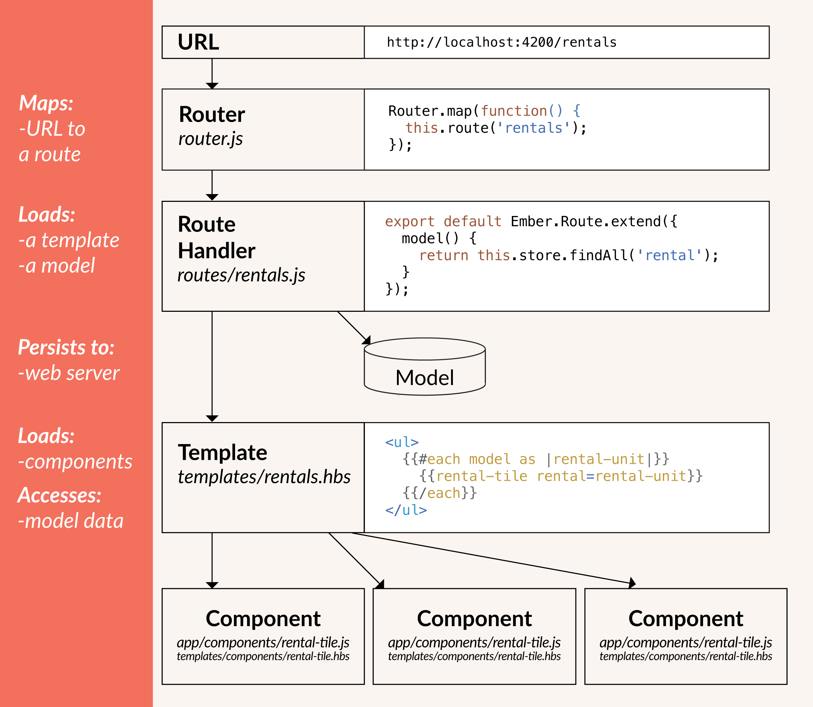

Antes de começar a escrever seu aplicativo Ember, é muito importante ter uma visão geral de como funciona.



## Gerenciamento de rotas (Router)

Imagine que estamos escrevendo um aplicativo web para um site que permite o usuário listar seus imóveis para alugar. A qualquer momento, devemos ser capazes de responder a perguntas sobre o estado atual, como *que imóvel está sendo olhado?* e *eles estão editando?* Em Ember, a resposta dessas perguntas é determinada pela URL. A URL pode ser definida de algumas maneiras:

* O usuário carrega o aplicativo pela primeira vez.
* O usuário altera o URL manualmente, por exemplo clicando no botão voltar ou editando a barra de endereços.
* O usuário clica em um botão ou link dentro do aplicativo.
* Algum outro evento no aplicativo que faz mudar a URL.

Não importa como a URL foi definida, a primeira coisa que acontece é que o router do Ember mapeia a URL para um gerenciador de rotas.

O gerenciador de rotas normalmente faz duas coisas:

* Ele renderiza um template.
* Ele carrega um model que estará disponível no template.

## Templates

Ember usa templates para organizar a layout do aplicativo.

A maioria das templates em um projeto Ember são familiares, e se parecem com um qualquer fragmento de HTML. Por exemplo:

```handlebars
<div>Hi, this is a valid Ember template!</div>
```

Os templates Ember usam a sintaxe [Handlebars](http://handlebarsjs.com). Toda sintaxe do Handlebars é aceita no Ember.

Templates can also display properties provided to them from their context, which is either a component or a route's controller. For example:

```handlebars
<div>Hi {{name}}, this is a valid Ember template!</div>
```

Aqui, `{{name}}` é uma propriedade fornecida pelo contexto da template.

Além de propriedades, chaves duplas (`{{}}`) podem conter também auxiliares e componentes, que discutiremos mais tarde.

## Modelos

Modelos representam um estado persistente.

Por exemplo, um aplicativo de aluguel de imóveis irá querer salvar os detalhes de uma locação quando um usuário publica-lo, e então uma locação teria um modelo definindo seus detalhes, talvez chamando o modelo de *locacoes*.

Um modelo tipicamente persiste informações para um servidor web, apesar de modelos poderem ser configurados para salvar em qualquer outro lugar, como armazenamento local no navegador (Local Storage).

## Componentes (Component)

Enquanto que as templates descrevem a aparência de uma interface de usuário, os componentes controlam como a interface *se comporta*.

Componentes consistem em duas partes: uma o template escrito em Handlebars, e um conjunto de código escrito em JavaScript que define o seu comportamento. Por exemplo, nossa aplicação de aluguel de imóveis pode ter um componente para exibir todas as locações chamado de `locacoes-todos` e outro componente para exibir uma locação individual chamado de `locacoes-item`. O componente `locacoes-item` pode definir um comportamento que permite ao usuário ocultar e mostrar a imagem da imóvel.

Vamos ver estes conceitos básicos em ação através da construção de uma aplicação de aluguel de imóveis na próxima lição.